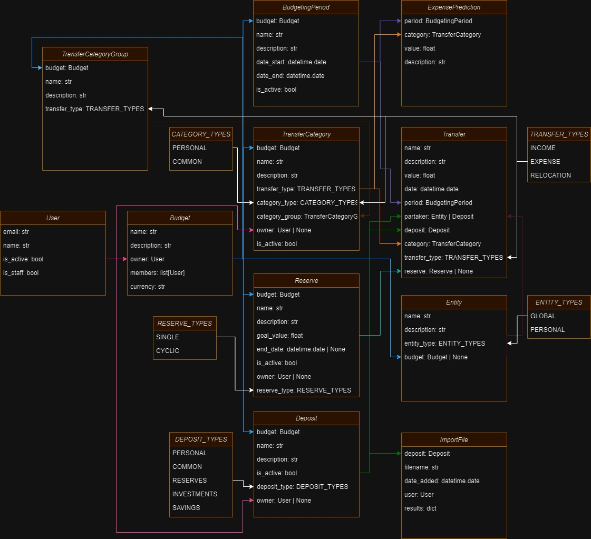

# BudgetManager API
REST API for BudgetManager application.

## Structure of models

## ✔️ User
API user representation.

### Fields:
- ✔️ email [str] - User email
- ✔️ name [str] - Custom name to display [optional]
- ✔️ is_active [bool] - Indicates if User is active
- ✔️ is_staff [bool] - Indicates if User is admin

### Features:
- ✔️ Authenticate with token
- ⛔ Google login

## ✔️ Budget
Groups financial data about particular area (family or company budget).
### Fields:
- ✔️ name [str] - Budget name
- ✔️ description [str] - Budget description [optional]
- ✔️ owner [User] - Owner of Budget
- ✔️ members [User] - Other members of Budget
- ✔️ currency [str] - currency in which all financial values will be presented

### Features:
- ✔️ Creating new Budget by authenticated User
- ⛔ Inviting other Users to Budget instead just adding them

## ⛔ BudgetingPeriod
Period in which financial values are aggregated.
### Fields:
- ⛔ budget [Budget] - Budget for period
- ✔️ name [str] - BudgetingPeriod name
- ✔️ description [str] - BudgetingPeriod description [optional]
- ✔️ date_start [User] - Start date of BudgetingPeriod
- ✔️ date_end [User] - End date of BudgetingPeriod
- ✔️ is_active [bool] - Indicates if BudgetingPeriod is active

### Features:
- ⛔ Creating new valid BudgetingPeriod by Budget member
- ⛔ Closing BudgetingPeriod by Budget member

## ⛔ Deposit
Represents "container" in which incomes are stored and source for expenses - bank accounts, cash, gold, etc.
### Fields:
- ⛔ budget [Budget] - Budget for Deposit
- ✔️ name [str] - Name of Deposit
- ✔️ description [str] - Deposit description [optional]
- ✔️ is_active [bool] - Indicates if Deposit is active
- ⛔ deposit_type [str] - Chosen Deposit type. Choices:
   - PERSONAL - personal Deposit
   - COMMON - Deposit for all Budget members
   - RESERVES - Deposit for storing Reserves
   - INVESTMENTS - Deposit for storing investments
   - SAVINGS - Deposit for savings
- ⛔ owner [User | None] - owner of Deposit

### Features:
- ⛔ Creating new Deposit by Budget member
- ⛔ Deactivating Deposit by Deposit owner

##  ⛔ TransferCategoryGroup
Group for TransferCategories.
### Fields:
- ⛔ budget [Budget] - Budget for TransferCategoryGroup
- ⛔ name [str] - Name of TransferCategoryGroup
- ⛔ description [str] - TransferCategoryGroup description [optional]
- ⛔ transfer_type [str] - Chosen Transfer type for TransferCategoryGroup. Choices:
   - INCOME - type for incomes
   - EXPENSE - type for expenses
   - RELOCATION - type for cash relocation between Deposits

### Features:
- ⛔ Creating new TransferCategoryGroup by Budget member
- ⛔ Removing TransferCategoryGroup by Budget member
- ⛔ Create predefined TransferCategoryGroup objects on Budget creation 

##  ⛔ TransferCategory
Category for grouping Transfers.
### Fields:
- ⛔ budget [Budget] - Budget for TransferCategory
- ✔️ name [str] - Name of TransferCategory
- ✔️ description [str] - TransferCategory description [optional]
- ⛔ transfer_type [str] - Chosen Transfer type for TransferCategory. Choices:
   - INCOME - type for incomes
   - EXPENSE - type for expenses
   - RELOCATION - type for cash relocation between Deposits
- ✔️ category_type [str] - Chosen TransferCategory type. Choices:
   - PERSONAL - category for particular Budget member
   - COMMON - category for all Budget members
- ⛔ category_group [str] - TransferCategoryGroup for TransferCategory
- ⛔ owner [User | None] - owner of TransferCategory with category_type = PERSONAL
- ✔️ is_active [bool] - Indicates if TransferCategory is active

### Features:
- ⛔ Creating new TransferCategory by Budget member
- ⛔ Removing COMMON TransferCategory by Budget member
- ⛔ Removing PERSONAL TransferCategory by TransferCategory owner
- ⛔ Create predefined TransferCategory objects on Budget creation

##  ⛔ ExpensePrediction
Amount expected to spend in selected BudgetingPeriod for selected TransferCategory.
### Fields:
- ⛔ period [BudgetingPeriod] - BudgetingPeriod for ExpensePrediction
- ⛔ category [TransferCategory] - TransferCategory for ExpensePrediction
- ⛔ value [float] - Amount expected to be spent for TransferCategory in given BudgetingPeriod
- ⛔ description [str] - Additional description for prediction [optional]

### Features:
- ⛔ Creating new ExpensePrediction by Budget member
- ⛔ Removing ExpensePrediction for COMMON TransferCategory by Budget member
- ⛔ Removing ExpensePrediction for PERSONAL TransferCategory by TransferCategory owner

## ⛔ Reserve
Abstract part of cash stored in Deposits marked as RESERVES designated to be spent on particular purpose.
### Fields:
- ⛔ budget [Budget] - Budget for Reserve.
- ⛔ name [str] - Name of Reserve.
- ⛔ description [str] - Description for Reserve. [optional]
- ⛔ goal_value [float] - Amount needed to spent on Reserve purpose.
- ⛔ end_date [datetime.date | None] - Deadline for gathering means for Reserve.
- ⛔ is_active [bool] - Indicates if Reserve is active.
- ⛔ owner [User | None] - Owner of Reserve. [optional]
- ⛔ reserve_type [str] - Type of Reserve. Choices:
  - SINGLE - Single time Reserve, f.e. buying TV.
  - CYCLIC - Cyclic Reserve, f.e. car insurance.

### Features:
- ⛔ Creating new Reserve by Budget member
- ⛔ Removing Reserve by Budget member if no owner set.
- ⛔ Removing Reserve for owner if owner set.

## ⛔ Entity
Representation of seller or payer, that is a source or goal of Transfer.
### Fields:
- ✔️ name [str] - Name of Entity
- ✔️ description [str] - Description of Entity [optional]
- ✔️ entity_type [str] - Type of Entity. Choices:
  - GLOBAL - Entity available to choose by all app Users
  - PERSONAL - Entity available to choose only in particular Budget
- ⛔ budget [Budget | None] - Budget in which Entity will be available [optional]

### Features:
- ⛔ Creating, removing and updating PERSONAL Entity by Budget member
- ⛔ Creating GLOBAL Entity by any User
- ⛔ Removing and updating GLOBAL Entity by admin user

## ⛔ Transfer
Representation of means flow between Deposit and Entity or another Deposit.
### Fields:
- ⛔ name [str] - Brief name of Transfer
- ⛔ description [str] - Broader description of Transfer [optional]
- ⛔ value [float] - amount spent or received by Transfer
- ⛔ date [datetime.date] - date of Transfer
- ⛔ period [BudgetingPeriod] - BudgetingPeriod for Transfer
- ⛔ partaker [Entity | Deposit] - object receiving or sending Transfer. Options:
  - Deposit for RELOCATION transfer_type - Budget Deposit into which money was sent
  - Entity for EXPENSE transfer_type - money paid some Entity for expense
  - Entity for INCOME transfer_type - money received from some Entity, like salary
- ⛔ deposit [Deposit] - Deposit from which or to which Transfer was made. Options:
  - RELOCATION transfer_type - Budget Deposit from which money was sent
  - EXPENSE transfer_type - Budget Deposit from which money was sent
  - INCOME transfer_type - Budget Deposit into which money was sent
- ⛔ category [TransferCategory] - TransferCategory for Transfer
- ⛔ transfer_type [str] - Chosen Transfer type for Transfer. Choices:
   - INCOME - type for incomes
   - EXPENSE - type for expenses
   - RELOCATION - type for cash relocation between Deposits
- ⛔ reserve [Reserve | None] - Reserve that status was updated by Transfer [optional]

### Features:
- ⛔ Creating, removing and updating Transfer with PERSONAL deposit.deposit_type by Deposit owner or Budget owner
- ⛔ Creating, removing and updating Transfer with other than PERSONAL deposit.deposit_type by any Budget member

## ⛔ ImportFile
Imported file containing Transfers and Entities for selected Deposit
### Fields:
- ⛔ deposit [Deposit] - Deposit for which data is imported
- ⛔ filename [str] - ImportFile name
- ⛔ date_added [datetime.date] - File upload date
- ⛔ user [User] - User uploading file
- ⛔ results [dict] - Dictionary containing objects created by file upload

### Features:
- ⛔ Upload file by Deposit owner for PERSONAL Deposit
- ⛔ Upload file by Budget member for non PERSONAL Deposit
- ⛔ Return data for further edition to frontend before creating objects in database
