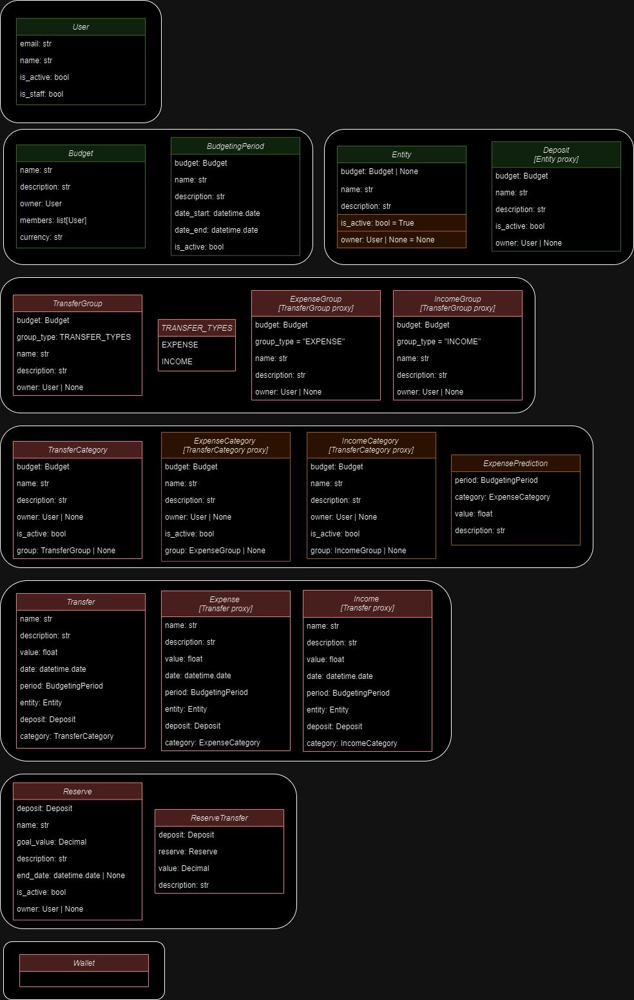

# BudgetManager API
REST API for BudgetManager application.

## Structure of models

## ✔️ User
API user representation.

### Fields:
- ✔️ email [str] - User email
- ✔️ name [str] - Custom name to display [optional]
- ✔️ is_active [bool] - Indicates if User is active
- ✔️ is_staff [bool] - Indicates if User is admin

### Features:
- ✔️ Authenticate with token
- ⛔ Google login

## ✔️ Budget
Groups financial data about particular area (family or company budget).
### Fields:
- ✔️ name [str] - Budget name
- ✔️ description [str] - Budget description [optional]
- ✔️ owner [User] - Owner of Budget
- ✔️ members [User] - Other members of Budget
- ✔️ currency [str] - currency in which all financial values will be presented

### Features:
- ✔️ Creating new Budget by authenticated User
- ⛔ Inviting other Users to Budget instead just adding them

## ✔️ BudgetingPeriod
Period in which financial values are aggregated.
### Fields:
- ✔️ budget [Budget] - Budget for period
- ✔️ name [str] - BudgetingPeriod name
- ✔️ description [str] - BudgetingPeriod description [optional]
- ✔️ date_start [User] - Start date of BudgetingPeriod
- ✔️ date_end [User] - End date of BudgetingPeriod
- ✔️ is_active [bool] - Indicates if BudgetingPeriod is active

### Features:
- ✔️ Creating new valid BudgetingPeriod by Budget member
- ✔️ Closing BudgetingPeriod by Budget member

## ✔️ Deposit 
Represents "container" in which incomes are stored and source for expenses - bank accounts, cash, gold, etc.
### Fields:
- ✔️ budget [Budget] - Budget for Deposit
- ✔️ name [str] - Name of Deposit
- ✔️ description [str] - Deposit description [optional]
- ✔️ is_active [bool] - Indicates if Deposit is active
- ✔️ deposit_type [str] - Chosen Deposit type. Choices:
   - PERSONAL - personal Deposit
   - COMMON - Deposit for all Budget members
   - RESERVES - Deposit for storing Reserves
   - INVESTMENTS - Deposit for storing investments
   - SAVINGS - Deposit for savings
- ✔️ owner [User | None] - owner of Deposit

### Features:
- ✔️ Creating new Deposit by Budget member

## ✔️ IncomeCategory
Category for grouping Incomes.
### Fields:
- ✔️ budget [Budget] - Budget for IncomeCategory
- ✔️ name [str] - Name of IncomeCategory
- ✔️ description [str] - IncomeCategory description [optional]
- ✔️ owner [User | None] - owner of IncomeCategory. `None` for common category.
- ✔️ is_active [bool] - Indicates if IncomeCategory is active
- ✔️ group [int | None] - Group of incomes

### Features:
- ✔️ Creating new IncomeCategory by Budget member
- ✔️ Create predefined IncomeCategory objects on Budget creation

## ✔️ ExpenseCategory
Category for grouping Incomes.
### Fields:
- ✔️ budget [Budget] - Budget for ExpenseCategory
- ✔️ name [str] - Name of ExpenseCategory
- ✔️ description [str] - ExpenseCategory description [optional]
- ✔️ owner [User | None] - owner of ExpenseCategory. `None` for common category.
- ✔️ is_active [bool] - Indicates if ExpenseCategory is active
- ✔️ group [int | None] - Group of expenses

### Features:
- ✔️ Creating new ExpenseCategory by Budget member
- ✔️ Create predefined ExpenseCategory objects on Budget creation

## ⛔ Entity
Representation of seller or payer, that is a source or goal of Income/Expense.
### Fields:
- ✔️ budget [Budget] - Budget in which Entity will be available [optional]
- ✔️ name [str] - Name of Entity
- ✔️ description [str] - Description of Entity [optional]
- ⛔ deposit [Deposit] - Deposit object represented by Entity in Incomes/Expenses [optional]

### Features:
- ⛔ Creating, removing and updating Entity by Budget owner or member

##  ⛔ ExpensePrediction
Amount expected to spend in selected BudgetingPeriod for selected ExpenseCategory.
### Fields:
- ⛔ period [BudgetingPeriod] - BudgetingPeriod for ExpensePrediction
- ⛔ category [ExpenseCategory] - ExpenseCategory for ExpensePrediction
- ⛔ value [float] - Amount expected to be spent for ExpenseCategory in given BudgetingPeriod
- ⛔ description [str] - Additional description for prediction [optional]

### Features:
- ⛔ Creating new ExpensePrediction by Budget member
- ⛔ Removing ExpensePrediction for COMMON ExpenseCategory by Budget member
- ⛔ Removing ExpensePrediction for PERSONAL ExpenseCategory by ExpenseCategory owner

## ⛔ Reserve
Abstract part of cash stored in Deposits marked as RESERVES designated to be spent on particular purpose.
### Fields:
- ⛔ budget [Budget] - Budget for Reserve.
- ⛔ name [str] - Name of Reserve.
- ⛔ description [str] - Description for Reserve. [optional]
- ⛔ goal_value [float] - Amount needed to spent on Reserve purpose.
- ⛔ end_date [datetime.date | None] - Deadline for gathering means for Reserve.
- ⛔ is_active [bool] - Indicates if Reserve is active.
- ⛔ owner [User | None] - Owner of Reserve. [optional]

### Features:
- ⛔ Creating new Reserve by Budget member
- ⛔ Removing Reserve by Budget member if no owner set.
- ⛔ Removing Reserve for owner if owner set.

## ⛔ Income
Representation of means flow between Deposit and Entity or another Deposit.
### Fields:
- ⛔ name [str] - Brief name of Income
- ⛔ description [str] - Broader description of Income [optional]
- ⛔ value [float] - amount received by Income
- ⛔ date [datetime.date] - date of Income
- ⛔ period [BudgetingPeriod] - BudgetingPeriod for Income
- ⛔ entity [Entity] - person/institution that pays us money
- ⛔ deposit [Deposit] - Deposit receiving money by Income
- ⛔ category [IncomeCategory] - IncomeCategory for Income
- ⛔ reserve [Reserve | None] - Reserve that status was updated by Income [optional]

### Features:
- ⛔ Creating, removing and updating Income with PERSONAL deposit.deposit_type by Deposit owner or Budget owner
- ⛔ Creating, removing and updating Income with other than PERSONAL deposit.deposit_type by any Budget member

## ⛔ Expense
Representation of means flow between Deposit and Entity or another Deposit.
### Fields:
- ⛔ name [str] - Brief name of Expense
- ⛔ description [str] - Broader description of Expense [optional]
- ⛔ value [float] - amount spent by Expense
- ⛔ date [datetime.date] - date of Expense
- ⛔ period [BudgetingPeriod] - BudgetingPeriod for Expense
- ⛔ entity [Entity] - person/institution that we are paying money
- ⛔ deposit [Deposit] - Deposit paying for Expense
- ⛔ category [ExpenseCategory] - ExpenseCategory for Expense
- ⛔ reserve [Reserve | None] - Reserve that status was updated by Expense [optional]

### Features:
- ⛔ Creating, removing and updating Expense with PERSONAL deposit.deposit_type by Deposit owner or Budget owner
- ⛔ Creating, removing and updating Expense with other than PERSONAL deposit.deposit_type by any Budget member
